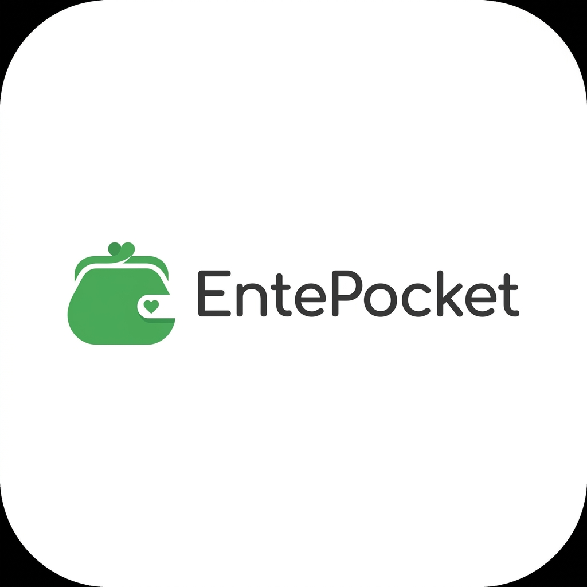

<div align="center">



# EntePocket

### A calm and simple household expense notebook for Indian families.

<p align="center">
  
  
  
  
</p>

</div>

---

# 🌿 The Problem

Indian households still manage daily expenses using:

- notebooks,
- diaries,
- WhatsApp messages,
- Excel sheets,
- or memory.

UPI apps already track online payments.

But what about:

- milk 🥛
- vegetables 🥬
- auto rides 🛺
- groceries 🛍️
- helper payments 👨‍🔧
- tea shop expenses ☕
- daily cash spending 💸

Those expenses quietly disappear.

And at the end of the month:
> “Cash evide poyi?” 😭

---

# ✨ What is EntePocket?

EntePocket transforms the traditional household notebook into a clean and collaborative mobile experience.

Built specifically for:
- Indian middle-class families
- Parents
- Non-technical users
- Shared household expense tracking

The goal is simple:

> Make expense tracking feel natural, stress-free, and familiar.

---

# 🧠 Product Philosophy

EntePocket is intentionally **NOT**:

❌ A fintech super app  
❌ A crypto dashboard  
❌ An investment tracker  
❌ A budgeting analytics platform  
❌ A banking application  

Instead, it is:
> “A digital household notebook.”

Simple.
Calm.
Human.

---

# 📱 Core Features

## 🔐 Phone OTP Login
- Fast mobile number login
- No passwords
- Familiar Indian onboarding flow

---

## 👨‍👩‍👧 Family Collaboration
Create or join family groups and track expenses together.

Perfect for:
- Parents
- Couples
- Shared households
- Hostel roommates

---

## 💸 Fast Expense Entry
Add expenses in seconds.

Includes:
- Amount
- Category
- Payment Type
- Optional Note
- Date

Payment types:
- Cash
- UPI
- Card

Cash is the default focus of the app.

---

## 📊 Monthly Overview
Simple monthly tracking without overwhelming analytics.

Track:
- Total spent
- Recent expenses
- Family activity
- Household spending flow

---

## 🔔 Recurring Bill Reminders
Track important bills like:
- Electricity
- WiFi
- Gas
- EMI
- Rent

Never miss due dates again.

---

## 📶 Offline First
No internet?
No problem.

Expenses can be added offline and synced automatically later.

---

# 🎨 Design Philosophy

EntePocket is designed to feel:

- Calm
- Spacious
- Familiar
- Trustworthy
- Parent-friendly

Inspired by:
- Google Pay simplicity
- WhatsApp usability
- Traditional Indian household notebooks

---

# 🪴 UI Principles

✅ White-first interface  
✅ Large readable typography  
✅ Soft green accents  
✅ Large touch targets  
✅ Minimal visual noise  
✅ Parent-friendly UX  

---

# 🚫 What We Avoid

- Dark mode
- Complex charts
- Fintech aesthetics
- Crypto-like UI
- Feature overload
- Aggressive notifications
- Confusing financial jargon

---

# 🛠️ Tech Stack

## Frontend
- React Native
- Expo
- TypeScript
- Expo Router

## Backend
- Supabase (PostgreSQL)

## Authentication
- Phone OTP Authentication
- Twilio SMS Provider

## State Management
- Zustand

## Local Storage
- SQLite
- AsyncStorage

## Notifications
- Firebase Cloud Messaging

---

# 📂 Project Structure

```txt
app/              → Expo Router routes & layouts
components/       → Shared UI components
services/         → API & sync logic
store/            → Zustand stores
hooks/            → Custom hooks
constants/        → Colors, categories, static values
types/            → TypeScript types
utils/            → Helpers & Supabase client
````

---

# 🧾 Expense Categories

Current MVP Categories:

* Groceries
* Food
* Transport
* Bills
* Medical
* Education
* Shopping
* Other

---

# 🚀 Getting Started

## 1️⃣ Clone Repository

```bash
git clone https://github.com/blitzbugg/entepocket.git
```

---

## 2️⃣ Install Dependencies

```bash
npm install
```

---

## 3️⃣ Setup Environment Variables

Create a `.env` file:

```env
EXPO_PUBLIC_SUPABASE_URL=YOUR_SUPABASE_URL
EXPO_PUBLIC_SUPABASE_ANON_KEY=YOUR_SUPABASE_ANON_KEY
```

---

## 4️⃣ Start Development Server

```bash
npx expo start
```

---

# 🔐 Backend Setup

Required services:

* Supabase
* PostgreSQL
* Twilio
* Phone OTP Authentication
* Row Level Security (RLS)

---

# 📱 Android First

EntePocket is optimized primarily for:

* Android devices
* Indian users
* Mid-range smartphones
* Parent-friendly mobile usage

---

# 🌱 Vision

EntePocket aims to help families build better financial awareness without complexity.

The goal is not financial perfection.

The goal is:

> consistency, clarity, and household discipline.

---

<div align="center">

# ❤️ EntePocket

### “A family notebook in your pocket.”

</div>
